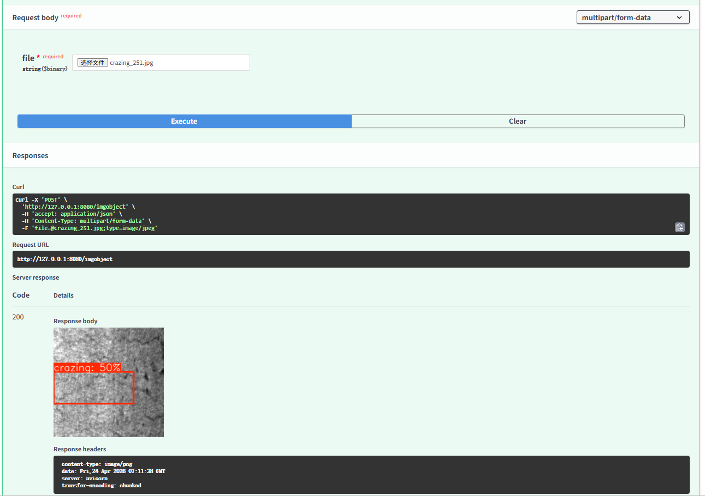
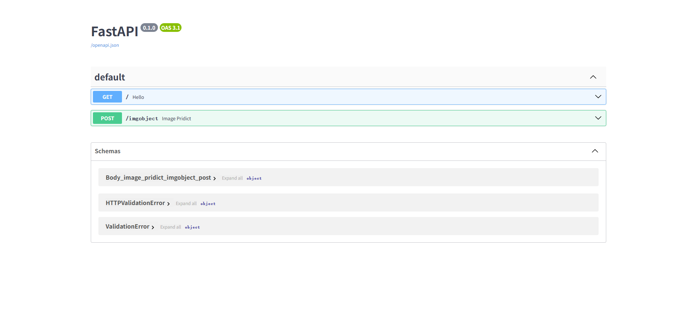

# YOLO-for-NEU-DET-dataset FastAPI：
这是一个使用YOLOV26对NEU-DET数据集进行目标检测的代码仓库，该项目还提供了一个使用FastAPI调用YOLOV26 ONNX模型的模板。

### English DOC：Comming soon~~

# 示例：
以下是本项目的部分内容示例：



---
# 开始

## 本地部署：
在本地部署该项目，需要一下几个步骤：

1.安装软件包：
```
pip install -r requirements.txt
```
2.启动应用：
```
python app.py
```

# FastAPI文档地址：
http://localhost:8080/docs



---
# 🚀代码示例：

### 示例1：
以下代码演示如何使用onnx模型进行目标检测推理任务，并返回检测结果：
```python
def ModelInference(Onnxmodel_path,providers,Image_path,confidence_threshold=0.5,imgs=224):
    """
    :param: Onnxmodel_Path: model path.模型位置
    :param: Providers: cuda cpu
    :param: Image_path:image path
    :param: confidence_threshold:defult 0.5
    :param: imgs: image size like 640*640
    :return: [[x,y,x,y],conf,cls]
    """
    try:
        session=LoadOnnxmodel(Onnxmodel_path,providers)
        img_array=ImageProcess(Image_path,imgs)
        outputs=session.run(None, {"images": img_array})
        predictions = outputs[0][0]  # 输出形状: (300, 6)
        confidence_threshold = confidence_threshold
        # predictions [x, y, w, h, conf, class] choose conf>confidence_threshold
        results=predictions[predictions[:, 4] > confidence_threshold]

        boxb=[]
        for r in results:
            boxarray=[]
            boxxyxy=r[0:4].tolist()
            boxconf=r[4].tolist()
            boxcls=r[5].tolist()
            boxarray.append(boxxyxy)
            boxarray.append(boxconf)
            boxarray.append(boxcls)
            boxb.append(boxarray)

        return boxb
    except Exception as e:
        print(e)
        return None
```
输出：
```
[[x,y,x,y],conf,cls]
```
此外该项目还有使用yolo自带工具进行推理的方法，ModelInferenceByYOLO()，输入参数跟输入与ModelInference()一样。
当然了该项目也提供了方法可以进行自定义调用：
```python
def get_model_pridict(Onnxmodel_path,providers,input_image,confidience=0.5,imgs=224,Inference_method='Normal'):
    """
    """
    try:
        if Inference_method=="YOLO":
            return OI.ModelInferenceByYOLO(Onnxmodel_path,providers,input_image,confidience,imgs)
        else:
            return OI.ModelInference(Onnxmodel_path,providers,input_image,confidience,imgs)
    except Exception as e:
        print(e)
        
        return None
```
输出：
```
[[x,y,x,y],conf,cls]
```
通过Inference_method=YOLO或者使用默认方式进行函数调用。

### 示例2：绘制检测结果在图像上
以下代码演示如何将检测结果绘制在图片上
```python
def add_bboxs_on_img(label,images,Inference_result):
    """
    """
    # Create an annotator object
    try:

        annotator=Annotator(np.array(images))

        #Inference_result [[x, y, w, h], conf, class]
        for r in Inference_result:
            bbox=r[0]
            text= f"{label[int(r[2])]}: {int(r[1]*100)}%"
            annotator.box_label(bbox,text,color=colors(r[2],True))
        
        return Image.fromarray(annotator.result()) 
    except Exception as e:
        # print(e)
        print("add_bboxs_on_img",e)
        return None
```
# 后续展望
1.不同平台部署ONNX模型。

2.TensorRT模型推理加速。

3.视频检测功能。

4.模型量化。

5..........